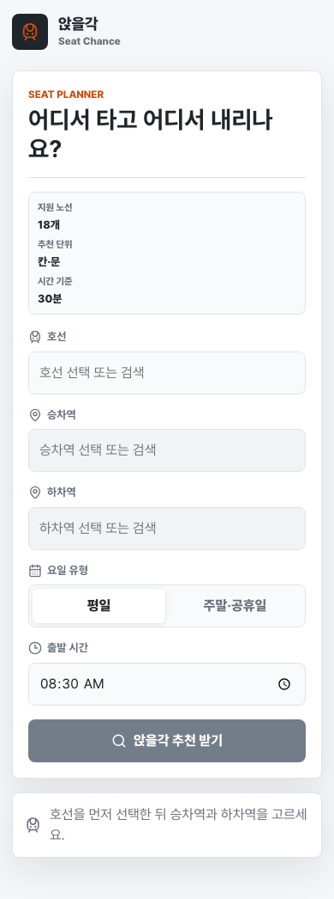
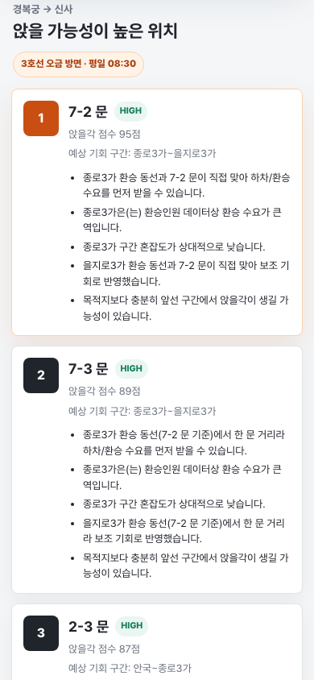

# 앉을각

서울 지하철에서 앉을 가능성이 높은 **칸·문 위치**를 추천하는 웹 서비스입니다.

서비스: https://seat-chance.vercel.app

## 무엇을 해주나요?

앉을각은 출발역, 하차역, 요일 유형, 출발 시간을 바탕으로 어느 칸의 어느 문 근처에 서면 좌석 회전 기회가 상대적으로 높은지 보여줍니다.

추천 결과는 다음을 포함합니다.

- 앉을 가능성이 높은 칸·문 Top 3
- 앉을각 점수
- 좌석 기회가 생길 가능성이 높은 중간 구간
- 추천 근거
- 열차 칸·문 배치

## 화면 예시

| 검색 화면 | 추천 결과 |
|---|---|
|  |  |

## 사용 방법

1. 호선을 선택합니다.
2. 승차역과 하차역을 선택하거나 검색합니다.
3. 요일 유형을 확인합니다. 기본값은 한국 시간 기준 오늘 날짜에 맞춰 `평일` 또는 `주말·공휴일`로 자동 설정됩니다.
4. 출발 시간을 선택합니다.
5. `앉을각 추천 받기`를 누릅니다.
6. 결과에 나온 `3-2 문` 같은 위치를 보고 해당 칸·문 근처에 섭니다.

`3-2 문`은 3호차의 2번째 문을 뜻합니다.

## 결과를 어떻게 읽나요?

앉을각 점수는 실제 착석 확률이 아닙니다. 같은 경로 안에서 어느 위치가 상대적으로 나은지 비교하기 위한 점수입니다.

예를 들어 `앉을각 점수 82점`은 “82% 확률로 앉는다”는 뜻이 아니라, 선택한 경로와 시간대에서 다른 문보다 좌석 회전 조건이 더 좋다는 뜻입니다.

추천 근거에는 보통 다음 요소가 반영됩니다.

- 중간역 하차 수요
- 환승 수요와 환승 동선
- 역별 혼잡도
- 같은 시간대 승차 수요
- 목적지까지 남은 거리

## 언제 유용한가요?

- 출퇴근 시간처럼 열차가 붐비는 시간
- 지하철을 여러 정거장 이상 타는 이동
- 어디에 서야 할지 빠르게 정하고 싶은 상황

다만 실시간 빈 좌석을 알려주는 서비스는 아닙니다. 실제 열차 상황, 지연, 행사, 날씨, 편성 차이 등은 결과와 다를 수 있습니다.

## 지원 데이터

앉을각은 공공 교통 데이터와 자체 정제 데이터를 이용합니다.

- 역별·시간대별 승하차 데이터
- 환승역 환승 수요
- 혼잡도 데이터
- 열차 칸·문 레이아웃
- 노선별 역 순서
- 한국 공휴일과 대체공휴일 판정

상세한 데이터 수집과 운영 방식은 [운영 문서](docs/OPERATIONS.md)를 참고하세요.

## 개발자용 빠른 시작

```bash
npm install
npm run dev
```

품질 확인:

```bash
npm run typecheck
npm test
npm run build
```

추천 API와 응답 형식은 [API 문서](docs/API.md)를 참고하세요.

## 문서

- [제품 원칙](docs/PRODUCT.md)
- [API 문서](docs/API.md)
- [데이터와 운영](docs/OPERATIONS.md)
